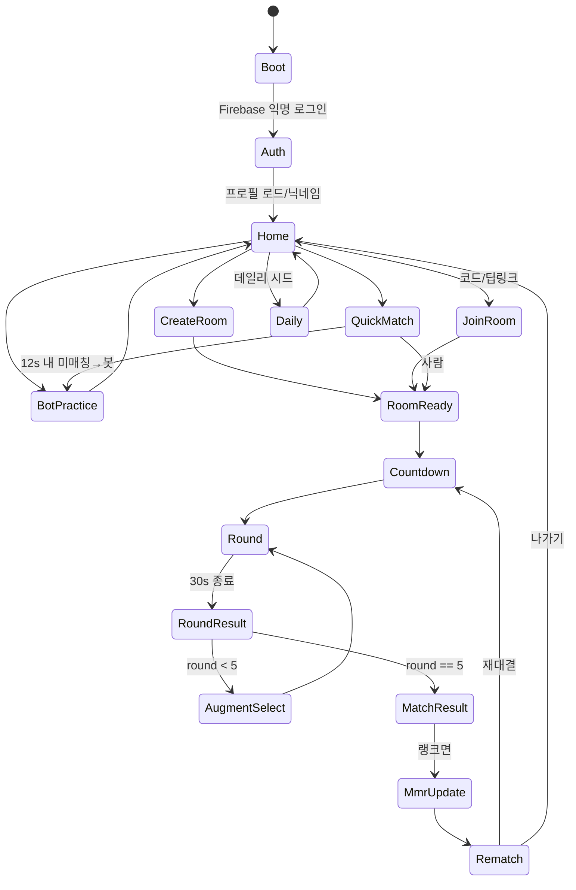
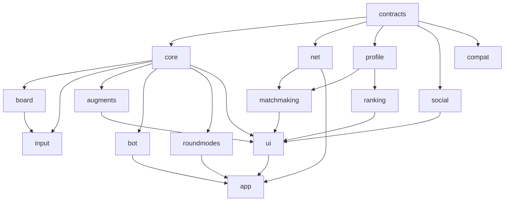

# 증강 사과게임 (Augmented Apple Game) — 개발 계획서

> **버전** v1.0 · **작성일** 2026-05-30 · **실행 주체** Claude Code / Claude Cowork 에이전트
> **한 줄 비전**: "합이 10이 되는 사과를 드래그로 담는" 사과게임(Fruit Box)의 중독적 코어 위에, *리그 오브 레전드 아레나*식 증강 빌드와 **실시간 1대1 랭크 대결**을 얹은 웹 게임. GitHub Pages 배포, Firebase 실시간 백엔드.

---

## 목차
0. [이 문서 사용법 (실행 에이전트용)](#0-이-문서-사용법-실행-에이전트용)
1. [제품 개요 & 핵심 기둥](#1-제품-개요--핵심-기둥)
2. [확정 사양 (Locked Spec)](#2-확정-사양-locked-spec)
3. [기술 스택 & 저장소 구조](#3-기술-스택--저장소-구조)
4. [모듈 아키텍처](#4-모듈-아키텍처)
5. [모듈 간 계약 (contracts)](#5-모듈-간-계약-contracts)
6. [데이터 모델 (Firebase RTDB)](#6-데이터-모델-firebase-rtdb)
7. [코어 게임 엔진 상세](#7-코어-게임-엔진-상세)
8. [증강 시스템 상세](#8-증강-시스템-상세)
9. [대결 모드 (RoundMode)](#9-대결-모드-roundmode)
10. [네트코드 & 동기화 설계](#10-네트코드--동기화-설계)
11. [매치메이킹 · 방 · 딥링크](#11-매치메이킹--방--딥링크)
12. [프로필 · 랭크(MMR/ELO) · 리더보드](#12-프로필--랭크mmrelo--리더보드)
13. [AI 봇 설계](#13-ai-봇-설계)
14. [소셜 · 공유 · 호환](#14-소셜--공유--호환)
15. [런타임 오케스트레이션 (상태 머신)](#15-런타임-오케스트레이션-상태-머신)
16. [빌드 오케스트레이션 계획 (에이전트 분담)](#16-빌드-오케스트레이션-계획-에이전트-분담)
17. [개발 단계 로드맵 (Phase 0–5)](#17-개발-단계-로드맵-phase-05)
18. [테스트 전략](#18-테스트-전략)
19. [배포 (GitHub Actions + Pages + Firebase + Kakao)](#19-배포-github-actions--pages--firebase--kakao)
20. [리스크 & 의사결정 로그](#20-리스크--의사결정-로그)
21. [정의된 완료 기준 & 런치 체크리스트](#21-정의된-완료-기준--런치-체크리스트)

---

## 0. 이 문서 사용법 (실행 에이전트용)

이 계획서는 **단일 마스터 세션(오케스트레이터)** 이 읽고, 모듈별 **서브에이전트**에게 작업을 분배하기 위한 것이다. 핵심 원칙 세 가지:

1. **계약 우선(Contract-First)**: 어떤 모듈도 구현하기 전에, 오케스트레이터가 `src/contracts/`(공유 타입·이벤트·인터페이스)를 §5대로 먼저 확정·커밋한다. 모든 모듈은 *오직 계약을 통해서만* 서로를 안다. 이것이 병렬 개발의 전제다.
2. **코어 순수성(Pure Core)**: `src/core/`는 프레임워크·DOM·네트워크·`Date.now()`를 절대 import하지 않는다. 입력은 `seed`와 action, 출력은 결정적(deterministic). 이래야 단위 테스트·재시뮬레이션·치팅 검증이 가능하다.
3. **단계별 출시(Shippable Phases)**: §17의 각 Phase 끝마다 GitHub Pages에 배포되어 실제로 플레이 가능해야 한다. Phase 0은 "혼자 하는 사과게임"으로 *재미부터 증명*한다.

**시작 명령(오케스트레이터의 첫 작업)** — §16 "Wave 0" 참조:
```
1) Vite + React + TS 스캐폴드, ESLint/Prettier, Vitest, GitHub Actions 설정
2) src/contracts/* 전체를 §5대로 작성 (로직 0, 타입/인터페이스/이벤트만)
3) Firebase 프로젝트·RTDB·Anonymous Auth·보안 규칙 초안 (§6, §19)
4) 의존성 그래프(§16)에 따라 Wave 1부터 서브에이전트 태스크 디스패치
```

---

## 1. 제품 개요 & 핵심 기둥

- **코어 루프**: 17×10 격자에 1~9 숫자 사과. 드래그로 **직사각형**을 그리면 그 안 사과들의 **합이 정확히 10**일 때 모두 제거되고 점수 획득. 제한 시간 동안 최대 점수.
- **증강 레이어**: 라운드 사이 3개 중 1개 선택(LoL 아레나식). 증강은 매치 내내 누적되어 "빌드"를 형성. 실버 → 골드 → 프리즘 3티어.
- **대결 레이어**: 실시간 1대1. 5라운드 × 30초. 라운드 점수 누적 + 라운드 승 보너스. 최종 누적 1위 승. MMR/ELO 랭크.
- **소셜 레이어**: 링크/카카오톡 공유, 친구 초대 보상 루프, 데일리 시드 챌린지로 유입·리텐션.

**4대 기둥** — 모든 설계 결정은 이 우선순위를 따른다:
| 우선 | 기둥 | 의미 |
|---|---|---|
| 1 | **즉각적 손맛** | 드래그·제거가 즉시·만족스럽게 반응 (파티클/사운드/이징) |
| 2 | **빌드의 쾌감** | 증강이 쌓일수록 점수가 폭발하는 성장감 |
| 3 | **공정한 긴장감** | 실시간 대결이 끊김 없이 동기화되고, 랭크가 신뢰 가능 |
| 4 | **바이럴 성장** | 공유 한 번이 새 유저·새 대결로 이어짐 |

---

## 2. 확정 사양 (Locked Spec)

| 항목 | 결정 |
|---|---|
| 플랫폼 | 웹 (데스크톱+모바일), GitHub Pages 정적 배포 |
| 프론트엔드 | React + PixiJS (메타 UI는 React, 보드 렌더는 Pixi) |
| 실시간 백엔드 | Firebase **Realtime Database** + **Anonymous Auth** (서버 프로필) |
| 매치 구조 | **5라운드 × 30초** |
| 승부 | 라운드 점수 **누적 합산** + **라운드 승자 보너스** → 최종 누적 1위 승 |
| 증강 획득 | 매 라운드 시작 직전 **3택1, 리롤 없음** (총 5회 픽) |
| 증강 티어 | R1·R2 **실버** → R3·R4 **골드** → R5 **프리즘(고정)** |
| 증강 누적 | 매치 내 누적(스택), 매치 종료 시 리셋 |
| 증강 계열 | 6종: 시간 / 콤보 / 보드 / 룰 / 하이리스크 / **강한 견제** |
| 대결 모드 | `RoundMode` 플러그인(같은보드 / 각자보드 / 방해형), 라운드·증강에 따라 가변 |
| 견제 강도 | **판을 흔드는 강한 견제 허용** (상대 보드 셔플/점수 흡수 등) |
| 랭크 | **MMR/ELO** (오르내림), 매치 후 갱신, 티어 산출, 리더보드 |
| 매치메이킹 | 빠른매칭(MMR 근접) + 비공개 방(코드) + 딥링크(`?room=`) |
| 상대 부재 시 | **AI 봇 매칭(언랭크, MMR 미반영)** |
| 신원 | Firebase 익명 인증 UID 기반 영구 프로필(닉네임/티어/전적) |
| 소셜 | 링크 공유 + 카카오 SDK 공유 + 초대 보상 루프 + 데일리 시드 챌린지 |
| 호환 | 인앱 브라우저(카톡 등) 감지 → 외부 브라우저 열기, 전체화면 토글 |
| 비주얼 | 세련된 사과게임 오마주 — 미니멀 프리미엄(제네릭 AI 룩 회피) |

---

## 3. 기술 스택 & 저장소 구조

### 스택
| 영역 | 선택 | 비고 |
|---|---|---|
| 빌드/번들 | **Vite** + TypeScript(strict) | `base: '/<repo-name>/'` (프로젝트 페이지) |
| UI | **React 18** | 화면·메뉴·HUD |
| 보드 렌더 | **PixiJS** | 사과 격자·드래그·파티클 |
| 전역 상태 | **zustand** (경량) | 런타임 상태머신과 UI 바인딩 |
| 백엔드 | **Firebase SDK** (RTDB, Auth) | 클라이언트 직접 연결 |
| 공유 | **Kakao JS SDK** + Web Share API | |
| 테스트 | **Vitest** (단위) + **Playwright**(E2E, 선택) + **Firebase Emulator**(net) | |
| 린트/포맷 | ESLint + Prettier | 코어 순수성 규칙(아래) 포함 |
| CI/CD | **GitHub Actions → GitHub Pages** | §19 |

> **린트 규칙(필수)**: `src/core/**` 에서 `react`, `pixi.js`, `firebase`, DOM 전역, `Date.now`/`Math.random` 직접 사용 금지(`no-restricted-imports`/`no-restricted-globals`). 무작위성은 주입된 `SeededRng`만 사용.

### 디렉터리 구조 (단일 Vite 앱 + 내부 모듈 경계)
```
augmented-apple-game/
├─ .github/workflows/deploy.yml
├─ public/                # 정적 에셋, 404.html(SPA 폴백), 아이콘, manifest
├─ src/
│  ├─ contracts/          # ★ 공유 타입·이벤트·인터페이스 (로직 0) — 가장 먼저
│  ├─ core/               # 순수 게임 엔진 (framework-free, 결정적)
│  ├─ augments/           # 증강 데이터(JSON) + 효과 훅 시스템
│  ├─ roundmodes/         # 대결 모드 플러그인
│  ├─ board/              # PixiJS 렌더 + 디자인 토큰
│  ├─ input/              # 포인터/터치 드래그 → 선택 사각형
│  ├─ net/                # Firebase RTDB 동기화·권위·검증
│  ├─ matchmaking/        # 큐 + 방코드 + 딥링크 + 봇 폴백
│  ├─ profile/            # 익명 인증 + 프로필 캐시
│  ├─ ranking/            # ELO/MMR/티어/리더보드
│  ├─ bot/                # AI 상대(언랭크)
│  ├─ social/             # 공유/카카오/초대보상/데일리시드
│  ├─ compat/             # 인앱 브라우저 감지·외부 열기·전체화면
│  ├─ ui/                 # React 화면 전부
│  ├─ app/                # 런타임 상태머신(conductor) + 모듈 와이어링
│  └─ main.tsx
├─ tests/                 # e2e(playwright), net 2-client 시뮬레이션
├─ firebase/              # database.rules.json, emulator config
├─ index.html
├─ vite.config.ts
├─ tsconfig.json
├─ package.json
└─ README.md
```

> `src/core`는 향후 `packages/core`로 분리 가능(완전 독립 테스트). 초기엔 폴더 경계 + 린트 규칙으로 충분.

---

## 4. 모듈 아키텍처

총 15개 모듈. 각 모듈은 단일 책임을 갖고, 계약(§5)을 통해서만 통신한다.

| # | 모듈 | 책임 | 직접 의존 | 핵심 산출물 |
|---|---|---|---|---|
| 1 | `contracts` | 공유 타입·인터페이스·이벤트 스키마 정의 | (없음) | 타입 파일 모음 |
| 2 | `core` | 보드 생성(시드)·합10 판정·점수·타이머·라운드 상태 | contracts | `CoreEngine` 구현 + 단위테스트 |
| 3 | `augments` | 증강 데이터 + 효과 훅 실행 + 티어 롤 + 3택1 로직 | contracts, core(타입만) | 증강 카탈로그 + `AugmentRuntime` |
| 4 | `roundmodes` | 대결 모드(같은/각자/방해) 플러그인 | contracts, core(타입만) | `RoundMode` 구현 3종 |
| 5 | `board` | PixiJS 보드/사과/선택박스 렌더·파티클·테마 | contracts | `BoardView` 컴포넌트 |
| 6 | `input` | 드래그 → 선택 사각형 → core 커밋, 전체화면 제스처 | contracts, board | `InputController` |
| 7 | `net` | RTDB 연결·방 수명·이벤트 동기화·충돌해결·검증 | contracts | `NetSession` |
| 8 | `matchmaking` | 빠른매칭 큐 + 방코드 + 딥링크 + 봇 폴백 | contracts, net, profile | `Matchmaker` |
| 9 | `profile` | 익명 인증·프로필 문서·로컬 캐시 | contracts, firebase | `ProfileService` |
| 10 | `ranking` | ELO 계산·티어 산출·리더보드 | contracts, profile | `RankingService` |
| 11 | `bot` | 합10 솔버 기반 AI 상대(난이도별, 언랭크) | contracts, core | `BotPlayer` |
| 12 | `social` | 공유(Web Share/Kakao)·초대보상·데일리시드 | contracts, profile | `ShareService`, `DailyChallenge` |
| 13 | `compat` | 인앱 브라우저 감지·외부 열기·전체화면 | (없음) | `CompatService` |
| 14 | `ui` | React 화면 전체(로비/매칭/HUD/증강선택/결과/리더보드/설정) | contracts, 다수(props로) | 화면 컴포넌트 |
| 15 | `app` | 런타임 상태머신·모듈 와이어링·세션 수명 | 전부 | `AppConductor` + `main.tsx` |

**규칙**: 화살표는 항상 `contracts` 또는 인터페이스를 향한다. `ui`는 서비스 구현이 아니라 *주입된 인터페이스/콜백*을 받는다. `app`만이 구현체를 조립한다.

---

## 5. 모듈 간 계약 (contracts)

> 아래는 **서브에이전트가 구현해야 할 정확한 인터페이스 스케치**다. 오케스트레이터는 이를 `src/contracts/`에 먼저 확정한다.

### 5.1 코어 (`contracts/core.ts`)
```ts
export type AppleValue = 1|2|3|4|5|6|7|8|9;
export type Cell = AppleValue | 0;            // 0 = 빈 칸(제거됨)
export interface Board { cols: number; rows: number; cells: Cell[]; } // row-major

export interface RoundConfig {
  seed: string;          // 결정적 보드 생성 키
  cols: number;          // 기본 17
  rows: number;          // 기본 10
  durationMs: number;    // 기본 30_000
  targetSum: number;     // 기본 10 (증강이 변경 가능)
  modeId: string;        // RoundMode 식별자
  augmentIds: string[];  // 이 플레이어의 누적 증강
}

export interface Rect { x0:number; y0:number; x1:number; y1:number; } // 포함 셀 = 격자 교집합
export interface SelectionEval { valid: boolean; sum: number; cells: number[]; }

export interface ClearResult {
  cells: number[]; count: number;
  baseScore: number; finalScore: number; comboMultiplier: number;
}
export type CommitResult = ClearResult | { rejected: true; reason: string };

export interface ClearAction { seq: number; rect: Rect; tMs: number; }

export interface CoreEngine {
  init(cfg: RoundConfig, rng: SeededRng, hooks: AugmentHookBus): void;
  getBoard(): Readonly<Board>;
  evaluate(rect: Rect): SelectionEval;          // 미리보기(하이라이트)용
  commit(action: ClearAction): CommitResult;    // 실제 제거
  tick(nowMonotonicMs: number): { remainingMs: number; ended: boolean };
  getScore(): number;
  /** 결정성 보증: 동일 seed+config → 동일 board, 동일 action 로그 → 동일 score */
  replay(actions: ClearAction[]): number;
}
```

### 5.2 무작위성 (`contracts/rng.ts`)
```ts
export interface SeededRng {            // 예: mulberry32 / xorshift128
  next(): number;                       // [0,1)
  int(maxExclusive: number): number;
  fork(label: string): SeededRng;       // 하위 시드 분기(셔플 등 동기화용)
}
export function makeRng(seed: string): SeededRng;
```

### 5.3 증강 (`contracts/augment.ts`)
```ts
export type AugTier = 'silver'|'gold'|'prismatic';
export type AugFamily = 'time'|'combo'|'board'|'rule'|'risk'|'disrupt';

export interface AugmentHooks {
  modifyRoundConfig?(cfg: RoundConfig): RoundConfig;        // 타이머/타깃/보드 변경
  onBoardInit?(b: Board, rng: SeededRng): void;             // 황금/와일드 사과 주입
  validateSelection?(c: SelCtx): Partial<SelOverride>|void; // 합9/11/10의배수 등
  onClear?(r: ClearResult, c: ClearCtx): ClearResult;       // 콤보/보너스/리스크/풍요
  onTick?(s: TickState, c: TickCtx): TickState;             // 시간 정지/감속
  emitSabotage?(c: SabCtx): SabotageEvent[];                // 상대 견제 발생
  onIncomingSabotage?(e: SabotageEvent, c: SabCtx): void;   // 들어온 견제 적용
}

export interface Augment {
  id: string; name: string; desc: string;
  tier: AugTier; family: AugFamily;
  hooks: AugmentHooks;
  stacks?: boolean; conflictsWith?: string[];
}

export interface AugmentHookBus {              // core가 호출, augments가 등록
  run<K extends keyof AugmentHooks>(point: K, ...args: any[]): any;
}
export interface AugmentRuntime {
  rollOffer(tier: AugTier, rng: SeededRng, owned: string[]): [string,string,string];
  pick(id: string): void;
  buildHookBus(): AugmentHookBus;              // 누적 증강 기준
}
```

### 5.4 대결 모드 (`contracts/roundmode.ts`)
```ts
export type PlayerId = string;
export interface RoundOutcome { perPlayer: Record<PlayerId,number>; winner: PlayerId|'draw'; bonus: number; }
export interface Claim { player: PlayerId; seq: number; cells: number[]; tsServer: number; }
export type ClaimResolution = { ok: true; cells:number[] } | { ok:false; reason:string };

export interface RoundMode {
  id: string;
  isShared: boolean;
  buildRound(seed: string, players: PlayerId[]):
    | { kind:'separate'; configs: Record<PlayerId, RoundConfig> }
    | { kind:'shared'; config: RoundConfig };
  resolveClaim?(claim: Claim, owned: Set<number>): ClaimResolution; // 같은보드 전용
  scoreRound(perPlayer: Record<PlayerId,number>): RoundOutcome;
}
```

### 5.5 네트워크 이벤트 (`contracts/net.ts`)
```ts
export type SabKind = 'blackout'|'shuffle'|'steal'|'freeze'|'junk';
export interface SabotageEvent { from:PlayerId; to:PlayerId; kind:SabKind; subseed:string; payload?:any; ts:number; }

export type NetEvent =
  | { t:'clear';        player:PlayerId; seq:number; cells:number[]; score:number; ts:number }
  | { t:'claim';        player:PlayerId; seq:number; cells:number[]; ts:number }   // shared
  | { t:'sabotage';     ev:SabotageEvent }
  | { t:'augment-pick'; player:PlayerId; round:number; augId:string }
  | { t:'round-result'; player:PlayerId; round:number; score:number }
  | { t:'phase';        phase:MatchPhase; round:number }
  | { t:'ready';        player:PlayerId; phase:MatchPhase }
  | { t:'heartbeat';    player:PlayerId; ts:number };

export type MatchPhase = 'lobby'|'countdown'|'round'|'augment'|'roundResult'|'matchResult';

export interface NetSession {
  join(roomId: string, profile: PublicProfile): Promise<void>;
  on(cb: (e: NetEvent)=>void): () => void;
  send(e: NetEvent): Promise<void>;
  claim?(cells:number[], seq:number): Promise<ClaimResolution>; // shared board: 트랜잭션
  close(): void;
}
```

### 5.6 프로필 / 랭크 (`contracts/profile.ts`)
```ts
export type Tier = 'Iron'|'Bronze'|'Silver'|'Gold'|'Platinum'|'Diamond'|'Master';
export interface Profile { uid:string; nickname:string; avatar:string; mmr:number; tier:Tier; wins:number; losses:number; games:number; unlocks:string[]; createdAt:number; }
export type PublicProfile = Pick<Profile,'uid'|'nickname'|'avatar'|'tier'|'mmr'>;

export interface ProfileService {
  signInAnon(): Promise<Profile>;
  get(): Profile;
  setNickname(n:string): Promise<void>;
}
export interface RankingService {
  applyResult(self:Profile, opp:PublicProfile, result:'win'|'loss'|'draw', ranked:boolean): Promise<{ mmrDelta:number; tier:Tier }>;
  leaderboard(top:number): Promise<PublicProfile[]>;
  tierFromMmr(mmr:number): Tier;
}
```

---

## 6. 데이터 모델 (Firebase RTDB)

### 트리 구조
```
/profiles/{uid}        : { nickname, avatar, mmr, tier, wins, losses, games, unlocks[], createdAt }
/leaderboard/{uid}     : { nickname, avatar, mmr, tier }          # 랭킹 조회용 미러
/queue/{uid}           : { mmr, tier, ts, modeSet }               # 빠른매칭 대기열
/rooms/{roomId}/
  meta                 : { hostUid, guestUid, inviterUid?, status:"open|full|playing|done", seedBase, createdAt }
  players/{uid}        : { nickname, avatar, mmr, tier, connected:bool, lastSeen }
  match/
    phase              : "lobby|countdown|round|augment|roundResult|matchResult"
    round              : 1..5
    roundSeed          : "<seedBase>:r<round>"
    augmentOffers/{uid}/{round} : [augId, augId, augId]
    picks/{uid}/{round}         : augId
    scores/{uid}                : { total, rounds:{ "1":n, ... } }
    events/{pushId}             : <NetEvent>                      # append-only 로그(검증용)
    shared/                     : { claims/{pushId}:<Claim>, owned:{ "<cellIdx>": uid } }  # 같은보드 모드
  result               : { winnerUid, scores, mmrDelta:{uid:delta}, ts }
/daily/{yyyy-mm-dd}/{uid} : { nickname, score, ts }               # 데일리 시드 챌린지
```

### 보안 규칙 초안 (`firebase/database.rules.json`)
```json
{
  "rules": {
    "profiles": {
      "$uid": {
        ".read": true,
        ".write": "auth != null && auth.uid === $uid",
        ".validate": "newData.hasChildren(['nickname','mmr','tier'])"
      }
    },
    "leaderboard": { ".read": true, "$uid": { ".write": "auth != null && auth.uid === $uid" } },
    "queue": { "$uid": { ".read": "auth != null", ".write": "auth != null && auth.uid === $uid" } },
    "rooms": {
      "$roomId": {
        ".read": "auth != null",
        ".write": "auth != null && (!data.exists() || data.child('players').child(auth.uid).exists() || !data.child('meta/guestUid').exists())",
        "match": { "events": { "$pushId": { ".validate": "newData.child('player').val() === auth.uid || newData.child('from').val() === auth.uid" } } }
      }
    },
    "daily": { "$d": { ".read": true, "$uid": { ".write": "auth != null && auth.uid === $uid" } } }
  }
}
```

> **주의**: Firebase 웹 config 키와 Kakao JS 키는 *공개 전제*다. 보안은 위 규칙으로 보장한다. 추가 강화는 **App Check(reCAPTCHA v3)** (선택) 또는 후일 **Cloud Functions(Blaze)** 서버 검증으로 확장한다(§20).

---

## 7. 코어 게임 엔진 상세

- **보드 생성**: `makeRng(seed)`로 17×10=170칸을 1~9 균등(또는 가중) 분포로 채움. **동일 시드 → 동일 보드** 보장. 양 클라이언트는 보드 격자 자체를 동기화하지 않고 *시드만 공유*한다.
- **선택 판정**: 드래그 사각형 `Rect`에 격자상 완전히/부분 포함되는 칸을 모은다(원작처럼 "박스 안 사과"). `sum(cells where cell>0) === targetSum`이고 사과가 1개 이상이면 유효. (증강이 `targetSum`/배수 규칙을 변경 가능 → `validateSelection` 훅.)
- **점수**: `baseScore = count`(제거된 사과 수). 표준은 사과 1개=1점. `onClear` 훅에서 콤보·보너스·리스크·배수 적용 → `finalScore`.
- **타이머**: `tick(nowMonotonicMs)`는 *주입된 단조 시계*(performance.now 래퍼, `app`에서 주입)를 받아 잔여 시간 계산. 코어 자체는 시계를 모름. `onTick` 훅으로 시간 정지/감속.
- **결정성 & 재시뮬레이션**: `replay(actions)`는 동일 시드+config로 보드를 재생성하고 action 로그를 순차 적용해 최종 점수를 재계산. → **치팅 검증의 토대**(§10).

> **성능**: 선택 미리보기(`evaluate`)는 드래그 중 매 프레임 호출되므로 O(rectCells). 2D prefix-sum을 유지해 사각형 합을 O(1)로 구하면 큰 보드에서도 부드럽다(봇 솔버와 공유).

---

## 8. 증강 시스템 상세

### 8.1 운영 규칙
- 매 라운드 시작 직전 **3택1**(리롤 없음), 총 **5회 픽**.
- 티어 스케줄: **R1·R2 실버 → R3·R4 골드 → R5 프리즘(고정)**.
- 양 플레이어는 *동일 풀에서 각자 랜덤 3개*를 제안받음(`rollOffer`는 라운드 시드 기반이되 플레이어별 `fork`). 이미 보유/충돌(`conflictsWith`) 증강은 제외.
- 증강은 매치 내내 **누적**되어 `AugmentHookBus`로 코어 동작을 패치. 매치 종료 시 리셋.

### 8.2 효과 훅 지점 (확장 포인트)
| 훅 | 호출 시점 | 용도 예 |
|---|---|---|
| `modifyRoundConfig` | 라운드 시작 전 | +시간, 타깃 합 변경, 보드 크기 |
| `onBoardInit` | 보드 생성 직후 | 황금/와일드 사과 주입(시드 RNG로 결정적) |
| `validateSelection` | 드래그 판정 | 합 9·11 인정, 10의 배수 인정 |
| `onClear` | 제거 성공 시 | 콤보 배수, 보너스, 리스크 감점, 풍요(즉시 보충) |
| `onTick` | 매 틱 | 시간 정지(유휴 시), 드래그 중 감속 |
| `emitSabotage` | 조건 충족 시 | 상대에게 셔플/블랙아웃/흡수 이벤트 발생 |
| `onIncomingSabotage` | 견제 수신 | 내 보드/화면/점수에 적용 |

### 8.3 증강 카탈로그 (데이터 주도, 확장 가능)
> 아래는 **초기 출시 세트**. `augments/data/*.ts`에 선언. 밸런스 수치는 플레이테스트로 조정.

| 계열 | 티어 | 이름 | 효과 | 사용 훅 |
|---|---|---|---|---|
| 시간 | 실버 | 여유 | 라운드 시작 시 +3초 | modifyRoundConfig |
| 시간 | 실버 | 초읽기 | 콤보 성공마다 +0.5초 | onClear |
| 시간 | 골드 | 잔상 | 드래그 중 시간 60% 감속 | onTick |
| 시간 | 프리즘 | 시간의 지배자 | 드래그하지 않는 동안 타이머 정지 | onTick |
| 콤보 | 실버 | 훈련 | 4개↑ 한 번에 제거 시 +5% | onClear |
| 콤보 | 골드 | 연쇄 | 콤보 유지 시 배수 1.5×, 끊기면 리셋 | onClear |
| 콤보 | 프리즘 | 무한 연쇄 | 콤보 절대 안 끊김, 배수 무제한 누적 | onClear |
| 보드 | 실버 | 재배치 | 라운드 시작 시 막힌 구간 1회 자동 정리 | onBoardInit |
| 보드 | 실버 | 와일드 | 라운드당 와일드 사과 1개(아무 값 대체) | onBoardInit, validateSelection |
| 보드 | 골드 | 황금 사과 | 라운드당 황금 사과 2개(점수 2배) | onBoardInit, onClear |
| 보드 | 프리즘 | 풍요 | 제거 자리에 즉시 새 사과 보충(무한 공급) | onClear |
| 룰 | 실버 | 친절 | 낮은 확률로 합 9도 인정 | validateSelection |
| 룰 | 골드 | 11의 길 | 합 10·11 동시 인정 | validateSelection |
| 룰 | 프리즘 | 연금술 | 10의 배수면 모두 인정(10·20·30…) | validateSelection |
| 하이리스크 | 골드 | 양날의 검 | 점수 1.8×, 실패 드래그마다 -3 | onClear |
| 하이리스크 | 프리즘 | 유리대포 | 점수 3×, 타이머 2배 속도 | modifyRoundConfig, onClear |
| 견제 | 실버 | 눈속임 | 라운드 시작 1초간 상대 숫자 흐림 | emitSabotage(blackout 약) |
| 견제 | 실버 | 잡티 | 라운드 시작 시 상대 보드에 잡템 사과 소량 | emitSabotage(junk) |
| 견제 | 골드 | 지진 | 라운드 중반 상대 보드 1회 셔플 | emitSabotage(shuffle) |
| 견제 | 골드 | 동결 | 상대 타이머/입력 1.5초 정지 | emitSabotage(freeze) |
| 견제 | 프리즘 | 강탈 | 이번 라운드 상대 획득 점수의 20% 흡수 | emitSabotage(steal) |
| 견제 | 프리즘 | 암전 | 상대 화면 2초 가림 | emitSabotage(blackout 강) |

> **결정성 주의**: 셔플 등 양 클라이언트가 동일 결과여야 하는 견제는 `SabotageEvent.subseed`로 `rng.fork(subseed)`를 써서 양쪽이 같은 배치를 산출한다. 점수에 영향을 주는 견제(강탈)는 §10의 *권위적 점수 정산*을 통해 적용한다.

### 8.4 심리전 훅(선택, Phase 5)
라운드 사이 증강 선택 화면에서 *상대가 쌓는 계열 힌트*를 노출하거나, 가끔 "상대 증강 1개를 다음 라운드 비활성화" 같은 견제형 메타 증강을 등장시켜 변수를 준다.

---

## 9. 대결 모드 (RoundMode)

대결 구조는 하드코딩하지 않고 `RoundMode` 플러그인으로 추상화한다(§5.4). 라운드별로 다른 모드를 배정할 수 있어 "라운드마다 판이 바뀌는" 아레나식 변주가 가능하다.

| 모드 | `isShared` | 설명 | 핵심 과제 |
|---|---|---|---|
| `separate` (각자 보드) | false | 양쪽 동일 시드 보드, 각자 플레이, 점수 경쟁 | 가장 단순·기본. Phase 2에서 먼저 구현 |
| `shared` (같은 보드 쟁탈) | true | 하나의 보드를 동시에 노려 사과를 먼저 제거 | **셀 클레임 충돌 해결** 필요(§10) |
| `sabotage` (방해형) | false | 각자 보드 + 견제 증강 효과 증폭 | 견제 이벤트 동기화·연출 |

- 매치 시작 시 `modeSet`(라운드별 모드 배열)을 결정. 기본 출시값 예: `[separate, separate, sabotage, shared, sabotage]` (밸런스 조정 대상).
- `scoreRound`가 라운드 승자·보너스를 산출하고, `app`이 누적 총점에 합산한다.

---

## 10. 네트코드 & 동기화 설계

**모델: 결정적 시드 + 이벤트/액션 동기화 (권장 기본값으로 확정).**

### 10.1 기본 흐름
1. 방의 `seedBase`를 공유 → 각 라운드 시드 = `"<seedBase>:r<round>"`. 양 클라이언트가 **동일 보드**를 로컬 생성(격자 자체는 전송 안 함).
2. 플레이어 행동은 `clear` 이벤트(제거 셀·점수·seq·ts)로 RTDB `events`에 append. 상대는 이를 구독해 "상대 진행 상황/점수"를 표시.
3. 각자 보드 모드에서는 행동이 자기 보드에만 적용되므로 **지연이 블로킹되지 않는다**(낙관적 로컬 적용 + 비동기 전파).

### 10.2 같은 보드(shared) 충돌 해결
- 같은 보드에서 두 플레이어가 같은 사과를 노릴 수 있다. **RTDB 트랜잭션**으로 `shared/owned`에 셀 클레임을 원자적으로 기록한다.
- `claim(cells, seq)` → 트랜잭션: 모든 대상 셀이 아직 미소유면 내 uid로 점유하고 `ok:true`, 하나라도 이미 점유면 `ok:false`(그 시도는 무효, 보드 유지). 서버 타임스탬프 순서로 선착 결정.
- 경쟁이 일어난 셀에서만 트랜잭션 지연이 발생하므로 일반 플레이는 빠르다.

### 10.3 견제(sabotage) 동기화
- `emitSabotage`가 만든 `SabotageEvent`를 `events`에 push. 수신측이 `onIncomingSabotage`로 적용.
- 결과 일치가 필요한 효과(셔플)는 `subseed` 기반 결정적 적용. 시각 전용(블랙아웃)은 로컬. **점수 영향(강탈)은 라운드 종료 정산에서 권위적으로 반영**.

### 10.4 권위 & 치팅 검증(무료 범위)
- 각 라운드 종료 시 양쪽이 `round-result`(자기 점수)를 보고.
- **결정적 재시뮬레이션**: 각 클라이언트는 *상대의 action 로그*를 `core.replay()`로 재계산해 보고 점수와 대조. 불일치 시 `result`에 `flagged` 표기.
- 랭크 매치에서 플래그가 뜨면: 해당 매치 MMR 미반영(보수적) + 로그 보존. (후일 Cloud Functions 서버 권위로 강화 가능.)
- 보드가 시드로 결정적이므로 "유효하지 않은 합 10" 같은 명백한 조작은 재시뮬레이션에서 즉시 드러난다.

### 10.5 지연·재접속
- 행동은 낙관적 로컬 적용 후 RTDB 확정. 모든 핵심 상태는 `rooms/{id}/match`에 영속 → 드롭된 클라이언트는 유예 시간(예: 20s) 내 재접속해 phase/round/score 복원.
- `heartbeat`/`players/{uid}/connected`로 상대 이탈 감지 → 이탈 시 봇 인계 또는 부전승 처리(랭크 정책에 따름).

### 10.6 시간 동기화
- 카운트다운·라운드 시작 시점은 호스트 기준 서버 타임스탬프로 정렬(`phase` 이벤트에 `startAtServerTs`). 클라이언트는 RTDB의 `serverTimeOffset`을 사용해 보정.

---

## 11. 매치메이킹 · 방 · 딥링크

- **비공개 방**: 6자 코드 생성(`roomId`). 호스트가 방을 만들고 `meta.status="open"`. 게스트가 코드 입력 또는 딥링크로 join.
- **딥링크**: URL `?room=AB12CD`. 진입 시 `compat` 체크 → 자동 join 시도. (쿼리 파라미터 방식이라 GitHub Pages 경로 라우팅 404 문제 없음. SPA 폴백용 `public/404.html`도 포함.)
- **빠른매칭**: `/queue/{uid}`에 `{mmr, ts}` 등록 → 가장 가까운 MMR 상대와 페어. 대기 시간이 길어지면 MMR 허용 범위를 점진 확대. 일정 시간(예: 12s) 내 매칭 실패 → **AI 봇(언랭크)** 폴백.
- **초대 추적**: 딥링크에 `&inv=<inviterUid>` → `meta.inviterUid` 저장 → 매치 완료 시 양측 초대 보상(§14).

```ts
export interface Matchmaker {
  createRoom(modeSet:string[]): Promise<{ roomId:string; link:string }>;
  joinRoom(roomId:string): Promise<NetSession>;
  quickMatch(): Promise<{ session:NetSession; opponent:'human'|'bot' }>;
  cancel(): void;
}
```

---

## 12. 프로필 · 랭크(MMR/ELO) · 리더보드

- **신원**: Firebase Anonymous Auth → 브라우저별 영구 UID(로컬에 자동 보존). `/profiles/{uid}`에 닉네임·아바타·MMR·티어·전적 저장 → 기기 내 유지 + 리더보드 가능. (후일 "계정 연결"로 교차기기 확장 여지.)
- **닉네임**: 최초 진입 시 입력(중복 허용, 비속어 간단 필터). 변경 가능.

### ELO 공식
```
기대 승률  E_self = 1 / (1 + 10^((mmr_opp - mmr_self) / 400))
갱신       mmr_self' = mmr_self + K * (S - E_self)
           S = 승1 / 무0.5 / 패0
K          = 40  (배치 10판 미만)
           = 24  (그 이후)
시작 MMR    = 1000
봇 매치     = 언랭크(K=0, 전적엔 별도 기록 가능)
```

### 티어 구간 (MMR)
| 티어 | MMR |
|---|---|
| Iron | < 800 |
| Bronze | 800–999 |
| Silver | 1000–1199 |
| Gold | 1200–1399 |
| Platinum | 1400–1599 |
| Diamond | 1600–1799 |
| Master | ≥ 1800 |

- 매치 종료 → `RankingService.applyResult` → MMR/티어 갱신 → `/leaderboard` 미러 업데이트 → 결과 화면에 ΔMMR·티어 변화 연출.

---

## 13. AI 봇 설계

- **목적**: 빠른매칭 상대 부재 시 항상 플레이 가능 + 연습. **언랭크**(MMR 미반영).
- **솔버**: 코어와 공유하는 2D prefix-sum으로 합==targetSum인 직사각형 후보를 열거(합>타깃이면 가지치기). 제거 후 증분 갱신.
- **난이도(자동: 내 티어에 맞춤, 또는 수동 선택)**:
  | 난이도 | 행동 간격 | 선택 품질 | 실수율 |
  |---|---|---|---|
  | 쉬움 | 1500–2500ms | 임의 유효 선택 | 높음 |
  | 보통 | 900–1500ms | 더 큰 제거 선호 | 중간 |
  | 어려움 | 400–900ms | 그리디 준최적 | 낮음 |
- 봇도 라운드 사이 증강을 *그럴듯하게* 픽해 동일 루프를 흉내낸다(계열 시너지 약간 고려).
- `BotPlayer`는 `NetSession`과 동일한 이벤트 인터페이스를 모사하는 로컬 어댑터로 동작 → `app`/`net` 입장에선 사람이든 봇이든 동일하게 처리.

---

## 14. 소셜 · 공유 · 호환

### 공유 (`social`)
- **범용**: `navigator.share`(모바일 네이티브 공유) → 미지원 시 클립보드 복사 + 토스트.
- **카카오톡**: Kakao JS SDK 로드 → `Kakao.init(JS_KEY)` → `Kakao.Share.sendDefault({...})`로 피드 메시지(제목/설명/이미지 + `?room=ID&inv=UID` 링크). 메시지 예: "○○○(골드)님이 증강 사과대결에 초대했어요!".
- **공유 권장 UX**: 결과·로비 화면에 "친구와 대결" CTA를 눈에 띄게 배치.

### 초대 보상 루프 (`social`)
- 딥링크 `inv` 추적 → 새 유저가 초대로 가입+첫 매치 완료 시 **양측에 한정 보상**(예: 사과 스킨, 추가 증강 해금 플래그를 `profiles.unlocks`에 기록). 바이럴 동력.

### 데일리 시드 챌린지 (`social`)
- 시드 = `hash(YYYY-MM-DD)` → 모든 유저가 같은 보드로 싱글 점수 경쟁(증강은 고정 룰셋 또는 미적용). `/daily/{date}/{uid}`에 제출, 일자별 리더보드. 1대1 상대가 없는 날의 리텐션 + 자랑용 공유 소재.

### 호환 (`compat`)
- **인앱 브라우저 감지**: UA에서 `KAKAOTALK`, `Instagram`, `FBAN/FBAV`, `Line` 등 탐지.
  - 감지 시 배너: "더 나은 플레이를 위해 크롬/사파리에서 열어주세요" + 버튼.
  - Android: `intent://...#Intent;scheme=https;...end` 또는 `kakaotalk://web/openExternal?url=` 스킴으로 외부 브라우저 호출.
  - iOS: 프로그램적 외부 열기가 비신뢰 → "우측 상단 ⋯ → Safari로 열기" 안내 가이드 표시.
- **전체화면**: 사용자 제스처에서 `requestFullscreen()`. 설정 토글 + 모바일 가로 방향 힌트.

---

## 15. 런타임 오케스트레이션 (상태 머신)

`app/AppConductor`가 전체 흐름을 관장하고 모듈 구현체를 조립한다(빌드타임 오케스트레이터와 구분되는 *런타임 지휘자*).



- **라운드 루프**: `Round(30s) → RoundResult → (round<5 ? AugmentSelect : MatchResult)`. AugmentSelect의 티어는 §8.1 스케줄.
- `app`은 `core`·`augments`·`board`·`input`·`net`·`roundmodes`를 라운드 단위로 초기화/정리하고, phase 전이를 `net`으로 양 클라이언트 동기화한다.

---

## 16. 빌드 오케스트레이션 계획 (에이전트 분담)

> 이 절이 **"누가 무엇을 어떤 순서로 만드는가"** 다. 실행 주체는 Claude Code/Cowork.

### 16.1 역할
- **오케스트레이터(메인 세션)**: 스캐폴드 + `contracts` 확정 + CI 구성 → 모듈 태스크를 서브에이전트에 분배 → 산출물을 계약 기준으로 검수·통합 → 전체 테스트 + 2-클라이언트 E2E → Phase별 배포·스모크. `contracts`는 단일 진실 공급원이며, 계약 변경은 오케스트레이터 승인 후 전파.
- **서브에이전트(모듈/태스크별)**: 격리된 브랜치(또는 git worktree)에서 *계약에만 의존해* 모듈 구현 + 단위테스트 + 모듈 README(편차/사용법). 테스트 통과가 머지 게이트.

> Claude Code: `Task`(서브에이전트)로 모듈을 병렬 위임, worktree로 충돌 최소화. Cowork: 병렬 에이전트로 동일 패턴.

### 16.2 의존성 그래프


### 16.3 병렬 웨이브 (= Phase 매핑)
| 웨이브 | 작업(병렬 가능) | 대응 Phase |
|---|---|---|
| **W0** 오케스트레이터 | 스캐폴드 · `contracts` · CI · Firebase 초기화 | (전 단계 기반) |
| **W1** | `core`(+결정성·합10·점수 단위테스트) | Phase 0 |
| **W2** (병렬) | `board` · `input` · `ui`(로비/HUD 기본) | Phase 0 |
| **W3** (병렬) | `augments`(데이터+훅) · `roundmodes:separate` | Phase 1 |
| **W4** (병렬) | `profile`(익명인증) · `net`(separate 동기화) · `matchmaking`(방+딥링크) | Phase 2 |
| **W5** (병렬) | `ranking`(ELO/티어/리더보드) · `net`(빠른매칭 큐) | Phase 3 |
| **W6** (병렬) | `roundmodes:shared`(클레임 트랜잭션) · `roundmodes:sabotage` · 견제 증강 동기화 | Phase 4 |
| **W7** (병렬) | `social`(공유/카톡/초대/데일리) · `bot` · `compat` · 비주얼·사운드 폴리시 | Phase 5 |

> `app`(런타임 지휘자)은 각 Phase에서 해당 모듈을 점진 통합한다(전 Phase에 걸쳐 성장).

### 16.4 서브에이전트 태스크 템플릿
```
[모듈] <이름>
[목표] 한 문장
[입력] 의존 계약 파일 경로(§5의 해당 인터페이스), 관련 §번호
[허용 의존] <모듈 목록 — 계약/인터페이스로만>
[구현할 공개 API] <인터페이스 시그니처>
[동작 명세] 핵심 규칙(이 문서 해당 절 인용)
[테스트 요구] 통과해야 할 단위/통합 테스트 목록
[완료 기준(DoD)] 아래 §21 표의 해당 행
[범위 외] 명시적으로 하지 말 것
[산출] 구현 + 테스트 + 모듈 README(편차 기록)
```

### 16.5 통합 규칙
- 모든 머지는 (a) 타입체크, (b) 해당 모듈 단위테스트, (c) 코어 결정성 테스트를 통과해야 한다.
- 네트워크 관련 머지는 **Firebase Emulator 기반 2-클라이언트 시뮬레이션**을 추가로 통과(§18).
- 계약 변경이 필요하면 구현을 멈추고 오케스트레이터에 에스컬레이션 → `contracts` 갱신 → 영향 모듈에 전파.

---

## 17. 개발 단계 로드맵 (Phase 0–5)

각 Phase는 끝나면 **GitHub Pages에 배포되어 플레이 가능**해야 한다.

| Phase | 제목 | 포함 | 출시 상태(플레이 가능 범위) |
|---|---|---|---|
| **0** | 코어 싱글 플레이 | contracts, core, board, input, ui(기본) | 혼자 30초 사과게임 — *재미 검증* |
| **1** | 증강 루프(싱글) | augments(데이터+훅+3택1 UI), roundmodes:separate, 라운드 진행 | 싱글에서 5라운드+증강 빌드 체험 |
| **2** | 실시간 1대1(각자 보드) | profile(익명), net(separate 동기화), matchmaking(방+딥링크) | 친구와 코드/링크로 실시간 대결(증강 포함, MMR 없음) |
| **3** | 랭크 + 빠른매칭 | ranking(ELO/티어), net(큐), 리더보드 UI | 랭크 매치·티어·리더보드 |
| **4** | 같은보드 & 강한 견제 | roundmodes:shared(클레임), sabotage, 견제 증강 동기화, 라운드별 모드 변주 | 모드가 바뀌는 풀 대결 경험 |
| **5** | 소셜·봇·폴리시 | social(공유/카톡/초대보상/데일리), bot(폴백), compat(인앱/전체화면), 비주얼·사운드 | 공개 가능한 완성형 |

---

## 18. 테스트 전략

- **`core` 단위(최우선)**: 합10 판정(경계·빈칸·다중 사과), 점수, **결정성**(동일 시드→동일 보드), **재시뮬레이션 일치**(action 로그→동일 점수).
- **`augments` 단위**: 증강별 훅 효과, **스택**(다중 증강 결합), 충돌 규칙, 결정적 견제(subseed).
- **`net` 통합**: Firebase Emulator로 **2-클라이언트 시뮬레이션** — separate 동기화, shared 클레임 충돌, 견제 전파, 재접속, 시간 정렬.
- **`ranking` 단위**: ELO 갱신·티어 경계·배치 K값.
- **E2E(선택, 권장)**: Playwright 2-브라우저로 비공개 방 풀 매치(1~5라운드+증강+결과) 자동 검증.
- **CI 게이트**: 타입체크 + 린트(코어 순수성 규칙 포함) + 단위 + 결정성 테스트는 모든 PR에서 필수.

---

## 19. 배포 (GitHub Actions + Pages + Firebase + Kakao)

### GitHub Pages
- `vite.config.ts`에 `base: '/<repo-name>/'`. SPA 폴백용 `public/404.html`(딥링크 보호 — 단, `?room=` 쿼리 방식이라 대부분 불필요).
- **워크플로 `.github/workflows/deploy.yml`**:
```yaml
name: deploy
on: { push: { branches: [main] } }
permissions: { contents: read, pages: write, id-token: write }
concurrency: { group: pages, cancel-in-progress: true }
jobs:
  build:
    runs-on: ubuntu-latest
    steps:
      - uses: actions/checkout@v4
      - uses: actions/setup-node@v4
        with: { node-version: 20, cache: npm }
      - run: npm ci
      - run: npm run test --if-present
      - run: npm run build
      - uses: actions/upload-pages-artifact@v3
        with: { path: dist }
  deploy:
    needs: build
    runs-on: ubuntu-latest
    environment: { name: github-pages, url: "${{ steps.deployment.outputs.page_url }}" }
    steps:
      - id: deployment
        uses: actions/deploy-pages@v4
```

### Firebase 설정 절차
1. Firebase 콘솔에서 프로젝트 생성 → **Realtime Database** 활성화(리전 선택) → **Authentication → Anonymous** 활성화.
2. 웹 앱 등록 → config 객체를 `src/net/firebaseConfig.ts`에 둠(공개 전제, 보안은 규칙으로). 
3. `firebase/database.rules.json`(§6) 배포: 콘솔 또는 `firebase deploy --only database`.
4. (선택) **App Check(reCAPTCHA v3)** 등록으로 무단 클라이언트 차단 강화.
5. Pages 도메인을 Auth **승인된 도메인**에 추가.

### Kakao 설정 절차
1. developers.kakao.com에서 앱 생성 → **JavaScript 키** 발급.
2. 플랫폼에 Pages 도메인 등록(Web).
3. `Kakao.init(JS_KEY)`로 초기화(키 공개 전제). 공유는 도메인 등록만으로 동작.

> **비밀이 아닌 키**: Firebase 웹 config·Kakao JS 키는 클라이언트 노출이 정상. 진짜 보안은 RTDB 규칙·도메인 화이트리스트·(선택) App Check. CI에 비밀 토큰이 필요한 경우(예: `firebase deploy`)에만 GitHub Secrets 사용.

---

## 20. 리스크 & 의사결정 로그

### 보류 질문 → Claude 권장 기본값으로 확정
| 항목 | 확정값 | 근거 |
|---|---|---|
| 빌드 오케스트레이션 | **계약 우선 → 병렬 → 통합**(오케스트레이터+서브에이전트) | 모듈 병렬화·통합 리스크 최소화 |
| 개발 스코프 | **MVP → 단계 확장(Phase 0–5)** | 복잡도 높음, 재미·핵심부터 검증 |
| 상태 동기화 | **결정적 시드 + 이벤트 동기화** | 가볍고 검증 가능, 무료 Firebase 적합 |

### 리스크 & 완화
| 리스크 | 완화 |
|---|---|
| 무료 Firebase는 기본 클라이언트 신뢰 → 치팅 | 결정적 재시뮬레이션 + 양측 보고 대조 + 플래그 시 MMR 미반영. 후일 App Check / Cloud Functions(Blaze) 서버 권위로 강화 |
| 빠른매칭 인구 부족 | AI 봇 폴백(확정) + 대기 시간 따라 MMR 범위 확대 + 데일리 챌린지 리텐션 |
| 강한 견제의 동기화/desync | 셔플은 subseed 결정적, 점수 영향은 권위적 정산, 견제는 Phase 4로 후행 |
| 카톡 인앱 브라우저 제약 | `compat` 감지 → 외부 브라우저 열기/안내 |
| 같은보드 공정성 | RTDB 트랜잭션 기반 셀 클레임 선착 정산 |
| 클라이언트 간 비결정성 | 코어 순수성 강제(린트), 주입된 SeededRng/단조시계만 사용, 로직 내 `Date.now`/`Math.random` 금지 |
| GitHub Pages 경로/딥링크 | `base` 설정 + `?room=` 쿼리 방식 + 404 폴백 |

---

## 21. 정의된 완료 기준 & 런치 체크리스트

### 모듈별 DoD (요약)
| 모듈 | 완료 기준 |
|---|---|
| contracts | 모든 §5 인터페이스 컴파일 통과, 로직 0 |
| core | 합10/점수/타이머 동작 + 결정성·재시뮬레이션 테스트 녹색 |
| augments | 카탈로그 로드 + 훅 동작 + 스택/충돌 테스트 + 결정적 견제 |
| roundmodes | separate/shared/sabotage 각 `buildRound`/`scoreRound`(+shared `resolveClaim`) 테스트 |
| board | 60fps 드래그 미리보기, 제거 파티클, 테마 토큰 적용 |
| input | 포인터/터치 드래그→Rect→commit, 전체화면 제스처 |
| net | 2-클라이언트 시뮬: separate 동기화·shared 충돌·견제 전파·재접속·시간정렬 통과 |
| matchmaking | 방 생성/조인/딥링크/빠른매칭/봇 폴백 동작 |
| profile | 익명 로그인 + 프로필 영속 + 닉네임 |
| ranking | ELO 갱신·티어·리더보드 + 단위 테스트 |
| bot | 난이도별 합10 솔버 플레이 + 증강 픽, 언랭크 처리 |
| social | Web Share/Kakao 공유, 초대 보상 기록, 데일리 시드 제출/리더보드 |
| compat | 인앱 감지+외부 열기/안내, 전체화면 토글 |
| ui | 모든 화면 + 디자인 토큰(미니멀 프리미엄), 모바일 반응형 |
| app | 풀 상태머신 1~5라운드 무결 진행 + 양 클라이언트 동기화 |

### 런치 체크리스트
- [ ] Phase 0–5 전부 Pages 배포·스모크 통과
- [ ] CI: 타입+린트(코어 순수성)+단위+결정성+net 시뮬 녹색
- [ ] Firebase 규칙 적용, Auth 승인 도메인 등록, (선택) App Check
- [ ] Kakao 도메인 등록·공유 카드 미리보기 정상
- [ ] 딥링크(`?room=`/`inv=`)로 초대→입장→대결→보상 전 경로 검증
- [ ] 모바일(iOS Safari/Android Chrome) + 카톡 인앱 폴백 점검
- [ ] 전체화면·가로 모드·터치 드래그 손맛 점검
- [ ] 리더보드·티어·ΔMMR 연출 점검
- [ ] 데일리 시드 챌린지 24시간 롤오버 점검

---

### 부록 A — 디자인 언어 지침 (ui/board 구현 에이전트용)
원작 사과게임 DNA(숫자 사과 격자 + 드래그 박스)는 유지하되, **미니멀 프리미엄**으로 격상한다: 따뜻하면서 절제된 팔레트, 부드러운 이징·스프링 모션, 제거 시 만족스러운 파티클·짧은 사운드, 여백 있는 타이포, 일관된 디자인 토큰. UI 구현 에이전트는 **`frontend-design` 스킬(`/mnt/skills/public/frontend-design/SKILL.md`)을 반드시 먼저 참조**해 제네릭 AI 룩을 피한다.

### 부록 B — 네이밍/시드 규약
- 방 코드: 대문자+숫자 6자(혼동 문자 I/O/0/1 제외).
- 시드: `seedBase = roomId + ":" + createdAt`. 라운드 시드 = `seedBase + ":r" + round`. 견제 subseed = `<eventPushId>`.
- 단조 시계: `app`이 `performance.now()` 래퍼를 코어/입력에 주입(테스트에선 가짜 시계).
